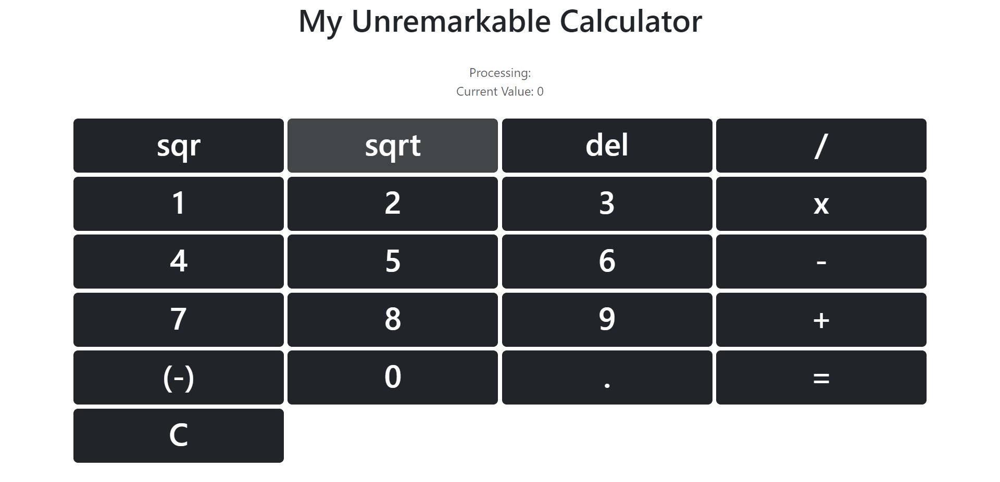

# Hello
This is a pretty unremarkable calculator I made in react with a bit of bootstrap. It's just a simple project for me to practice my skills.

# How to use
Use 'npm start' to run the application in localhost:3000
Go to localhost:3000 on a web browser.

Here's how it looks like:

